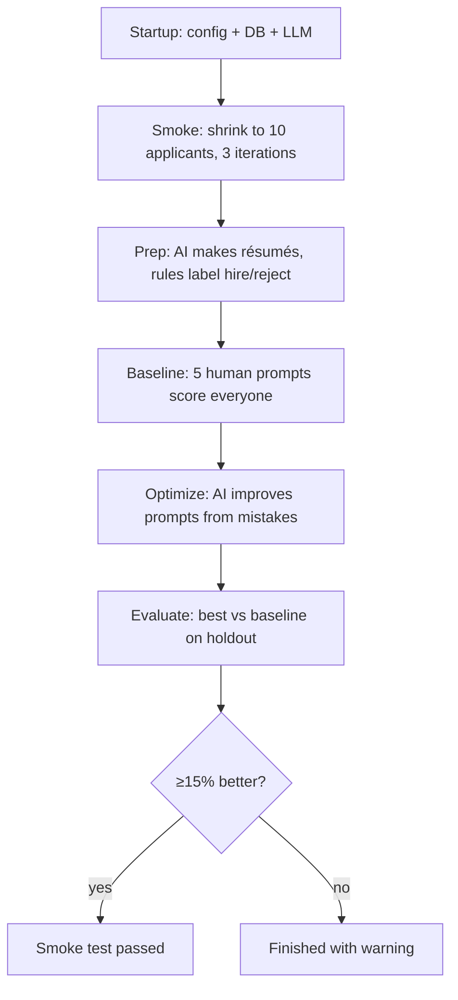

# What Happens When You Run `python main.py --phase smoke-test`

This document explains the smoke test end-to-end for someone new to the project — no prior background required.

---

## The Big Picture (One Sentence)

This project is a **mini hiring lab**: it simulates hiring software engineers, uses an AI (Ollama locally or AWS Bedrock in the cloud) to **score applicants**, and then tries to **improve the scoring instructions** automatically.

The smoke test is a **short, cheap rehearsal** of the full pipeline — same steps, tiny data.

---

## What the Software Is Trying to Answer

> *“Can we teach an AI to evaluate job candidates better than the hand-written prompts we started with?”*

The smoke test runs that experiment on **10 fake applicants** instead of 200, and runs only **3 optimization rounds** instead of 25.

---

## Before Any Phase Runs: Startup

When you run the command, `main()` does setup work first.

### 1. Load settings

- Reads `config.yaml` (job title, skills, dataset sizes, baseline prompts, etc.)
- Reads `.env` (which AI to use: Ollama on your machine vs AWS Bedrock)

### 2. Open a database

- Creates or opens `data/gepa.db` (SQLite — a local file that stores everything)
- Creates tables if they don’t exist (applicants, prompts, scores, logs)

### 3. Connect to the AI

- If `LLM_PROVIDER=ollama`, talks to Ollama at `http://localhost:11434`
- Prints something like “Connected to Ollama” and lists available models

Nothing “smart” happens yet — this is just wiring.

---

## What “Smoke Test” Means

A **smoke test** is industry slang for: *“Does the whole system turn on without catching fire?”*

This command does **not** run the full production experiment. It shrinks the problem on purpose:

| Setting | Full run (`--phase all`) | Smoke test |
|--------|---------------------------|------------|
| Applicants | 200 | **10** |
| Train / holdout | 150 / 50 | **~7 / ~3** |
| Optimization rounds | 25 | **3** |

Then it runs **four phases in order**, same as the full pipeline:

1. Data preparation
2. Baseline evaluation
3. GEPA optimization
4. Evaluate and compare

---

## Phase 1: Data Preparation — “Build Fake Applicants”

**Goal:** Create a small pool of synthetic résumés and label each as **hire (1)** or **reject (0)**.

### Step 1a — Generate résumés with AI

- The job is defined in `config.yaml` (e.g. “Senior Software Engineer”, needs Python, system design, etc.)
- The AI is asked to invent résumés as JSON (name, skills, experience, education, work history, etc.)
- For the smoke test: **10 résumés** are requested (often in one batch)

This is typically the **slowest** step when using Ollama — one large generation call.

### Step 1b — “Oracle” labels (ground truth)

- A **deterministic rules engine** (not the LLM) decides hire/reject for each résumé:
  - Does the candidate have required skills?
  - Enough years of experience?
  - A small amount of random “noise” so labels aren’t perfectly predictable (simulates real-world messiness)
- These labels are treated as **the correct answer** for all later scoring

### Step 1c — Split train vs holdout

Résumés are split into:

- **Train** (~7): used to improve prompts during optimization
- **Holdout** (~3): held back to test whether improvements generalize (like a final exam)

### Step 1d — Save and validate

- Everything is stored in `data/gepa.db`
- The phase prints dataset stats and warnings if the tiny sample looks odd (common and expected in smoke test)

**Analogy:** You’re casting actors for a play — the AI writes fake actors’ bios, a script supervisor marks who “should” get the role, and you split the cast into “practice” and “final audition” groups.

**Note:** If you run the smoke test again **without deleting the database**, this phase may **skip generation** (“Dataset already exists”) and reuse old data. For a clean rerun: `rm -f data/gepa.db`.

---

## Phase 2: Baseline Evaluation — “How Good Are Our Human-Written Prompts?”

**Goal:** Measure how well the **starting prompts** (defined in `config.yaml`) predict hire vs reject.

### What are “prompts” here?

They are not casual chat messages. They are **5 evaluation rubrics**, for example:

- Technical Depth (score 1–5)
- Problem-Solving Ability
- Cultural Fit
- Communication Skills
- Career Trajectory

Each rubric tells the AI how to score one dimension of a candidate.

### What happens for each applicant

For **every applicant** in the train set, then the holdout set:

1. Load their résumé from the database
2. For **each of the 5 prompts**, call the LLM: “Score this person 1–5 and explain why”
3. **Average** the five scores
4. If the average is **≥ 3.0** → predict **hired**; otherwise **rejected**
5. Compare the prediction to the oracle label → correct or incorrect

For ~6 train applicants × 5 prompts, that is roughly **30 LLM calls** for train alone (plus holdout). You will see a progress bar like `Evaluating candidate 1: 17%...`.

### Results stored

- Per-applicant, per-prompt scores
- Aggregate metrics: **accuracy** (how often hire/reject matches the oracle), precision, recall, etc.
- Logged as **iteration 0** — the human-authored baseline

**Analogy:** Five judges each rate a contestant; you average their scores; if the average is high enough, you say “yes.” Then you check how often that matches the “true” casting decision.

---

## Phase 3: GEPA Optimization — “Try to Improve the Judges’ Instructions”

**GEPA** (in this POC) is a loop that **evolves** evaluation prompts using mistakes as feedback.

The smoke test runs only **3 iterations** (vs 25 in a full run).

### 3a — Generate seed candidates

- The LLM invents **alternative sets of 5 prompts** (starting variations)
- By default: **3 seed sets** (`seed_candidates: 3` in `config.yaml`)
- Each seed set is evaluated on the **train** split (many more LLM calls)

### 3b — Pareto pool (keep the best trade-offs)

Candidates are not ranked on accuracy alone. The system keeps a **Pareto frontier**: prompt sets that are strong on multiple goals at once (e.g. accuracy vs precision on “hired” predictions).

Only competitive candidates stay in the pool (up to `pareto_max_size`).

### 3c — Main loop (3 times in smoke test)

Each iteration roughly:

1. **Pick a parent** — choose one strong prompt set from the Pareto pool
2. **Find worst failures** — applicants the parent scored incorrectly on the train set
3. **Reflect** — another LLM call analyzes mistakes: which rubric failed, and what wording change might help
4. **Mutate** — produce a **new** prompt set (typically one rubric edited)
5. **Evaluate** the child on the train set again
6. **Update** the Pareto pool and log metrics

**Analogy:** A coach watches game tape (failures), rewrites one section of the scouting rubric, and re-tests the team.

**Reality check:** With local Ollama and some models (e.g. `gemma3`), this phase may fail if the model returns **invalid JSON** for seeds or reflection. The Pareto pool can end up empty and optimization stops early. That is usually a **model quality** issue, not broken plumbing.

---

## Phase 4: Evaluate and Compare — “Did We Beat the Baseline?”

**Goal:** Answer whether the best evolved prompt set beats the human baseline on **unseen** data.

1. Load optimization state — which candidates are in the Pareto pool
2. Pick the **best on train** (by accuracy among Pareto members)
3. Run that candidate on the **holdout** set (fresh LLM evaluations)
4. Compare holdout accuracy to the **baseline holdout** result from Phase 2
5. Print improvement percentage — the POC success target is **≥ 15% relative improvement**

Example output shape:

```
Baseline accuracy: 0.667
Optimized accuracy: 0.800
Improvement: +20.0%
✅ SUCCESS: ...
```

If improvement is below 15%, the run may still finish but prints a warning.

---

## End State: What You Have on Disk

After a successful run:

| Artifact | Purpose |
|----------|---------|
| `data/gepa.db` | Applicants, prompt candidates, every score, optimization logs |
| Console output | Phase banners, metrics, warnings |
| LLM call history | Logged in the database (cost is $0 for Ollama) |

The smoke test does **not** launch the dashboard. To visualize results later:

```bash
python main.py --phase dashboard
```

---

## How Many AI Calls? (Rough Intuition)

For a smoke test with ~9 applicants and 5 prompts per evaluation:

| Phase | Rough order of magnitude |
|-------|---------------------------|
| Data prep | 1 large generation call |
| Baseline | ~9 × 5 × 2 splits ≈ 90 calls (if not cached) |
| Optimize | Seeds + 3 iterations × (reflect + evaluate) — can be **hundreds** |
| Evaluate | Additional holdout evaluations |

With Ollama locally, total runtime is often **tens of minutes to over an hour**, depending on model (`mistral` is faster than `gemma3`).

---

## Pipeline Overview



---

## What “Success” Means

### Technical success

All four phases complete without crashing — proves wiring, database, LLM connection, and the GEPA loop work.

### Scientific success (POC goal)

Optimized prompts beat the baseline by **≥ 15%** on holdout accuracy. On only ~3 holdout applicants, this is **not statistically meaningful**; the smoke test is mainly a **health check**, not a valid experiment.

---

## Common Messages (and What They Mean)

| Message | Meaning |
|---------|---------|
| “Dataset already exists, skipping generation” | DB from a prior run; delete `data/gepa.db` for a clean rerun |
| Validation warnings (dataset too small, hire ratio odd) | Normal for the smoke test’s tiny sample |
| Read timeout | Generation or evaluation exceeded `OLLAMA_TIMEOUT` — increase it or use a faster model |
| “Pareto pool is empty” | Seed generation or JSON parsing failed; optimization had nothing to improve |

---

## Summary in Plain English

Running `python main.py --phase smoke-test` is like running a **mini hiring simulation**:

1. **Invent** 10 fake candidates and decide who “should” be hired
2. **Score** them with your original 5 evaluation rubrics (baseline)
3. **Automatically rewrite** those rubrics using AI feedback (GEPA)
4. **Check** whether the rewritten rubrics do better on candidates they were not tuned on

It is the full product story in miniature — useful to verify everything works before committing to a long full run with 200 applicants and 25 optimization rounds.

---

## Related Docs

- [README.md](README.md) — setup and overview
- [OLLAMA.md](OLLAMA.md) — local testing with Ollama
- [config.yaml](config.yaml) — job description, dataset sizes, baseline prompts
